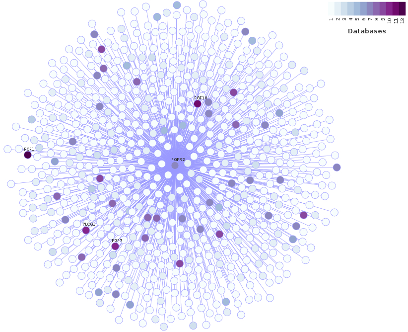

#The FGFR2interactome package
This package provides data and instructions to reproduce two computational methods - protein-protein interaction (PPI) network plots and modulatory analysis based on Mindy algorithm - contained in the article entitled **"EPHA2 and PBX1 mediate FGFR2 signalling associated with breast cancer risk regulators and modulate tamoxifen responsiveness"**.

The two first plots in this vignette depicts an equivalent representation of the constructed PPI networks shown as **Fig2** in the article (depicted below). The networks were built through datamining of 13 databases when searched for FGFR2-interacting proteins of tissue-specific and tissue-inespecific situations.

```{r, echo= FALSE, out.width = "800px"}

```
<caption>**Figure 1** - PPI network arrangement presented in the article. **a** - Tissue-inespecific network for healthy human organism. **b** - Healthy breast tissue-specific interactions.  </caption>

The second analysis featured in this vignette, the modulatory analysis based on Mindy algorithm, will compute which FGFR2-interacting proteins are candidate modulators of transcriptional factors important for breast cancer phenotype. The results for two FGFR2 transducers, PBX1 and EPHA2, can be seen in **Fig.4c** and **Fig.4d** of the article and are also depicted below. 


```{r, echo= FALSE, out.width = "800px"}
knitr::include_graphics("figs/FIG4_vignette.png")
```

# Plotting FGFR2 interactomes

##Load necessary tools

###Packages
To call necessary packages, run the lines below. If one or more packages are not yet installed, you can get them at the Bioconductor repository.

```{r eval=FALSE}
library(RedeR)

library(igraph)

library(RColorBrewer)
```
  
### Data-mining results
```{r eval=FALSE}
data("Body_PPI")

data("Breast_PPI")
```

##Call Java interface for RedeR
```{r eval=FALSE}
rdp<- RedPort()

calld(rdp)
```

## Tissue-inespecific connections
Create variables containing the vertices and edges. Convert data frame to an igraph object.
```{r eval=FALSE}
vert_fgfr2_ints<- Body_PPI[,c(2,17)]
edge_fgfr2_ints<- Body_PPI[,c(1,2)]
colnames(edge_fgfr2_ints)<- c("from", "to")

gr_fgfr2_ints<-graph_from_data_frame(edge_fgfr2_ints, directed = T, vertices = vert_fgfr2_ints)
```

Choose nodeColor pallete to receive values from the "Total" column.
```{r eval=FALSE}
rcb<- brewer.pal(9, "BuPu")
color_col <- colorRampPalette(rcb)(13)

gr_fgfr2_ints<- att.setv(g=gr_fgfr2_ints, from="Total", to="nodeColor", cols = color_col)
```

Plot the igraph object into the RedeR's Java interface, add legend and organize plot with relax function.
```{r eval=FALSE}
addGraph(rdp, gr_fgfr2_ints, gcoord=c(50,50), gscale=110, theme= 'tm1')
addLegend.color(rdp, colvec=gr_fgfr2_ints, title="Databases")
relax(rdp,p1=10,p2=80,p3=10,p4=100,p5=100,p6=100,p7=10,p8=10,ps=FALSE)
```

Select nodes that represent connections that occured 10 times or more along the databases and select FGFR2, as well.
```{r eval=FALSE}
selected<-c(as.character(Body_PPI$Int.2[which(Body_PPI$Total>=10)]), "FGFR2")

nodes_to_hide<- Body_PPI$Int.2[-which(Body_PPI$Int.2 %in% selected)]
selectNodes(rdp,nodes_to_hide)
```
After selecting nodes, go to the Java interface, right click on a selected node, go to Label and choose the option Hide.

Run this next line to deselect the nodes and see the final graph.
```{r eval=FALSE}
deSelectNodes(rdp)
```

```{r, echo= FALSE, fig.width = 15, fig.height=15}

```

## Breast tissue-specific connections
First, clean the Java interface environment. 
```{r eval=FALSE}
resetd(rdp)
```

Create variables containing the vertices and edges. Convert data frame to an igraph object.
```{r eval=FALSE}
vert_ppi_m<- Breast_PPI[,c(2,8)]
edge_ppi_m<- Breast_PPI[,c(1,2)]
colnames(edge_ppi_m)<- c("from", "to")
gr_ppi_m<-graph_from_data_frame(edge_ppi_m, directed = T, vertices = vert_ppi_m)
```

Choose nodeColor pallete to receive values from the "Total" column.
```{r eval=FALSE}
rcb<- brewer.pal(9, "BuPu")
color_col <- colorRampPalette(rcb)(13)

gr_ppi_m<- att.setv(g=gr_ppi_m, from="Total", to="nodeColor", cols = color_col)
```

Plot the igraph object into the RedeR's Java interface, add legend and organize plot with relax function.
```{r eval=FALSE}
addGraph(rdp, gr_ppi_m, gcoord=c(50,50), gscale=110, theme= 'tm1')
addLegend.color(rdp, colvec=gr_ppi_m, title="Databases")
relax(rdp,p1=10,p2=80,p3=10,p4=100,p5=100,p6=100,p7=10,p8=10,ps=FALSE)
```

Select nodes that represent connections that occured 3 times or more.
```{r eval=FALSE}
selected<- c(as.character(Breast_PPI$Int.2[which(Breast_PPI$Total>=3)]), "FGFR2")
nodes_to_hide<- Breast_PPI$Int.2[-which(Breast_PPI$Int.2 %in% selected)]
selectNodes(rdp,nodes_to_hide)
```
After selecting nodes, go to the Java interface, right click on a selected node, go to Label and choose the option Hide.

Run this next line to deselect the nodes and see the final graph.
```{r eval=FALSE}
deSelectNodes(rdp)
```

```{r, echo= FALSE, out.width = "800px"}

```


# Modulatory analysis (Mindy algorithm)

Clean the global environment
```{r eval=FALSE}
rm(list = ls())
```

## Load necessary tools
### Packages
```{r eval=FALSE}
library(RTN)
library(Fletcher2013b)
```

### Datasets from Fletcher, M. et al., 2013
```{r eval=FALSE}
data("rtni1st")
data("rtni2nd")
rtni1st<- upgradeTNI(rtni1st)
rtni2nd<- upgradeTNI(rtni2nd)
```

### Data-mining results
```{r eval=FALSE}
data("Breast_PPI")
```

```{r eval=FALSE}
# Obtain all gene symbols in rtni1st or rtni2n
prots_1st<- as.vector(rtni1st@rowAnnotation$SYMBOL)
prots_2nd<- as.vector(rtni2nd@rowAnnotation$SYMBOL)

# Selection, removal of duplicated and concatenation of gene symbols to be used as candidate
# modulators (those that interact with fgfr2)
data4mod<- c(as.character(Breast_PPI$Int.2))
data4mod<- data4mod[!duplicated(data4mod)]
modulators_1st<- prots_1st[prots_1st%in%data4mod]
modulators_2nd<- prots_2nd[prots_2nd%in%data4mod]

# Retrieve PROBEIDs for each modulator
idx_1st<- which(prots_1st%in%data4mod)
mod_probeid_1st<- rtni1st@annotation$PROBEID[idx_1st]
idx_2nd<- which(prots_2nd%in%data4mod)
mod_probeid_2nd<- rtni2nd@annotation$PROBEID[idx_2nd]
```

## Selection of Transcription Factors
```{r eval=FALSE}
# TF clusters related with breast cancer risk (CASTRO, M. et al., 2015)
TFs<- c("SNAPC2", "MZF1", "RARA", "AR", "SPDEF", "ZNF587", "ARNT2", "BRD8", "MYB",
        "ESR1", "GATA3", "YPEL3", "FOXA1",  "AFF3", "XBP1", "ZNF552", "NFIB", "YBX1",
        "TBX19", "SOX10", "CEBPB", "TRIM29", "CBFB")
```
## Conditional Analysis
```{r eval=FALSE}
# With cohort one
cond_1st<- tni.conditional(rtni1st, modulators = mod_probeid_1st, tfs = TFs,
                           pValueCutoff = 1e-3)
res_1st<- tni.get(cond_1st, what = "cdtrev")

# With cohort two
cond_2nd<- tni.conditional(rtni2nd, modulators = mod_probeid_2nd, tfs = TFs,
                           pValueCutoff = 1e-3)
res_2nd<- tni.get(cond_2nd, what = "cdtrev")
```
## Results
```{r eval=FALSE}
mods_1st<-list()
mods_1st$PROBEID<-names(unlist(lapply(res_1st, nrow)))
idx_mods<- which(rtni1st@rowAnnotation$PROBEID %in% mods_1st$PROBEID)
mods_1st$SYMBOL<-rtni1st@rowAnnotation$SYMBOL[idx_mods]

mods_2nd<-list()
mods_2nd$PROBEID<-names(unlist(lapply(res_2nd, nrow)))
idx_mods<- which(rtni2nd@rowAnnotation$PROBEID %in% mods_2nd$PROBEID)
mods_2nd$SYMBOL<-rtni2nd@rowAnnotation$SYMBOL[idx_mods]
```

```{r eval=FALSE}
# save in a RData
save(cond_1st, cond_2nd, file = "./FGFR2_Conditional_TNIs.RData")
save(res_1st, res_2nd, file = "./FGFR2_Conditional.RData")
save(mods_1st, mods_2nd, file= "./FGFR2_Conditional_Annotation.RData")
```
